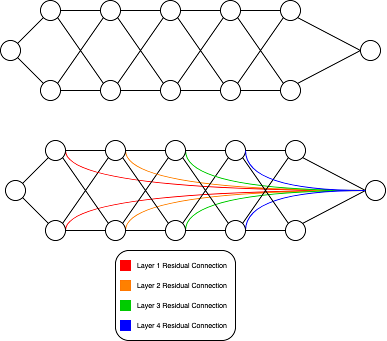

## Late Residual Connections

This repository is a cleaned version of my research on the vanishing gradient problem with dead ReLUs. My research suggest an approach to combat dead ReLUs with residual connections called Late Residual Connections. These connections are added directly to the output of a neural network. For my research purposes, this code only creates networks of width two and any depth. Please feel free to use the code and add on to the research! Please feel free to contact me [here](mailto:matthew.f.ernst@gmail.com) for any questions.

### Example of A Late Residual Connection Neural Network

Below is an example of an abstracted view of traditional versus late residual neural networks. Each hidden layer has a late residual connection the output. To simplify, this connection allows for moregradient flow to each neuron in the network.




## Setup and How to Run

To run the Jupyter Notebooks, you will need a Python version of 3.8 or higher. Run the following commands below to create your environment and install the required packages.

```bash
python3 -m venv env
source env/bin/activate
python3 -m pip install --upgrade pip
python3 -m pip install -r requirements.txt
```


